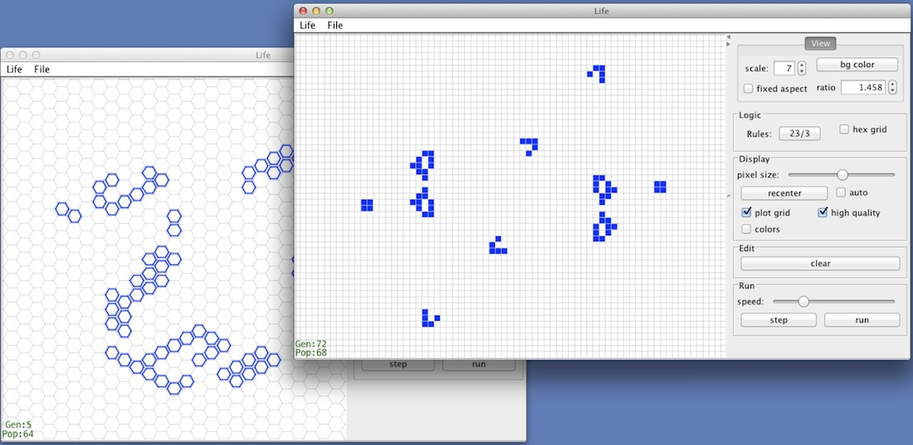

Hex Life
===========

This is a Java implementation of [Conway's Game of Life](http://en.wikipedia.org/wiki/Conway's_Game_of_Life).  

It includes several built-in patterns (gliders, guns, etc.).

As a special feature, it supports hexagonal grids, and allows you 
to specify what the rules are in this case, i.e., the number of 
neighbors that allow an existing cell to survive, or an absent one to be born.
This was my main motivation to write this program, and as it turns out, life on a hexagonal grid isn't very interesting!

The program can be run as an application; its main class is life.LifeMain.class.
It can also be run as an applet, by loading the page "Applet.html" within a browser
(or from the command line: "appletviewer Applet.html"), or by visiting [this link](http://www.cs.ubc.ca/~jpsember/life.html).

